# 软件使用指南

pinout-generator是为了方便用户将BSP对接到[RTduino](https://github.com/RTduino/RTduino)上而设计的一个自动化源文件生成工具。下面以 [stm32f103-blue-pill](https://github.com/RT-Thread/rt-thread/tree/master/bsp/stm32/stm32f103-blue-pill/applications/arduino_pinout) 为例，展示如何使用本软件，并将该BSP对接到RTduino上。

**参考资料：**
- [RTduino对接文档](https://github.com/RTduino/RTduino/blob/master/README_zh.md#4-%E5%A6%82%E4%BD%95%E7%BB%99%E6%9F%90%E4%B8%AAbsp%E9%80%82%E9%85%8Drtduino)

## 1 如何对接

### 1.1 添加BSP路径

### 1.2 添加RT-Thread引脚跟Arduino引脚的对应关系

可以右键唤起菜单，或者直接点击快捷添加按钮，其他的像插入、删除等等，都是对这个表进行操作。

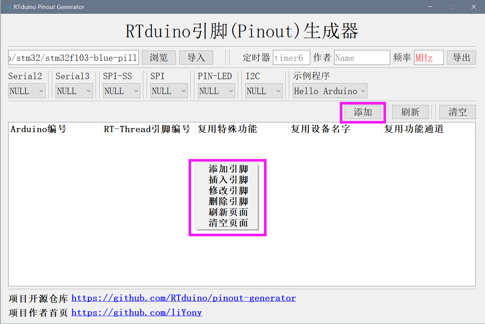

目前支持以下IO对应关系：

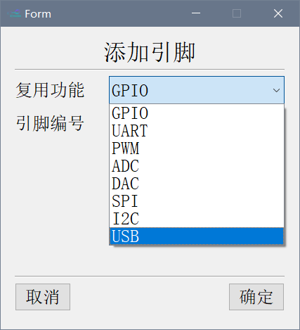

对于stm32f103-blue-pill这款BSP的引脚对应关系如图：

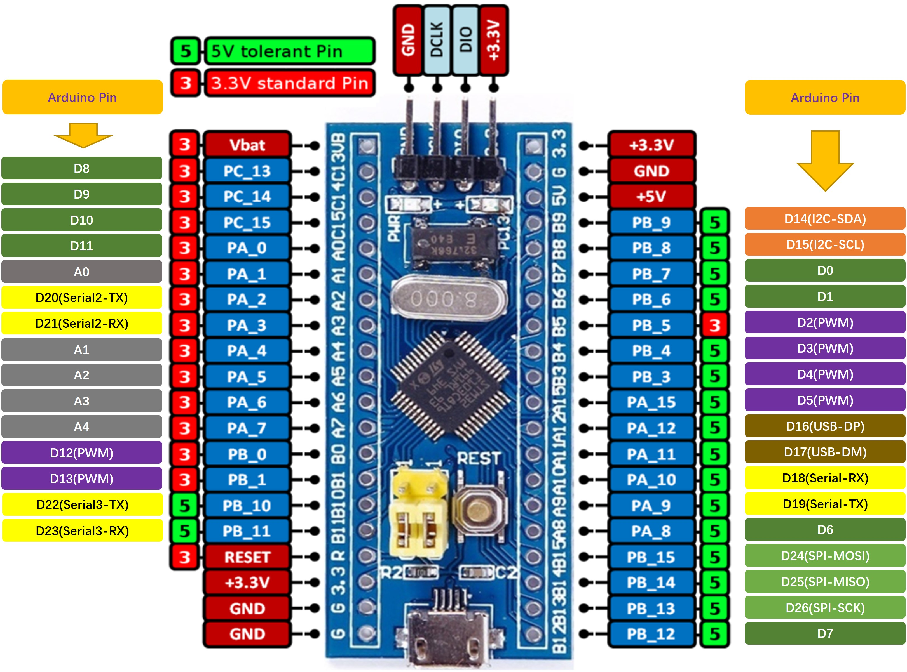

因此，我们完成这个表格

### 1.3 填写一些重要选项

这时候我们再来看看这几个选项：

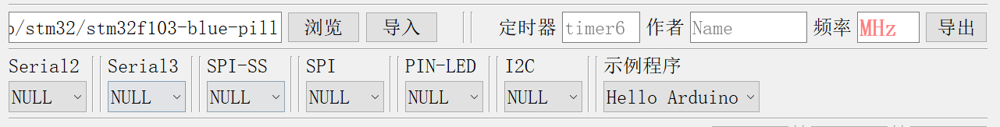

- Serial2：表示板子除了终端串口另外支持的串口。

- Serial3：表示板子除了终端串口另外支持的串口。

- SPI-SS：表示的是SPI的SS(片选)引脚的编号。

- SPI：表示对接的默认SPI设备。

- PIN-LED：表示默认的LED灯引脚。

- I2C：表示对接的默认I2C设备。

- 示例程序：表示生成的默认程序内容，这里包括print或者ledblink。

- 定时器：表示默认定时器。

- 频率：表示BSP工作的主频，是必填项。
- 作者：表示对接这个的人

根据BSP引脚分布图，这一块进行如下配置：

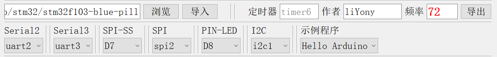

### 1.4 导出文件

这时候我们就可以导出了，会生成以下几个重要文件

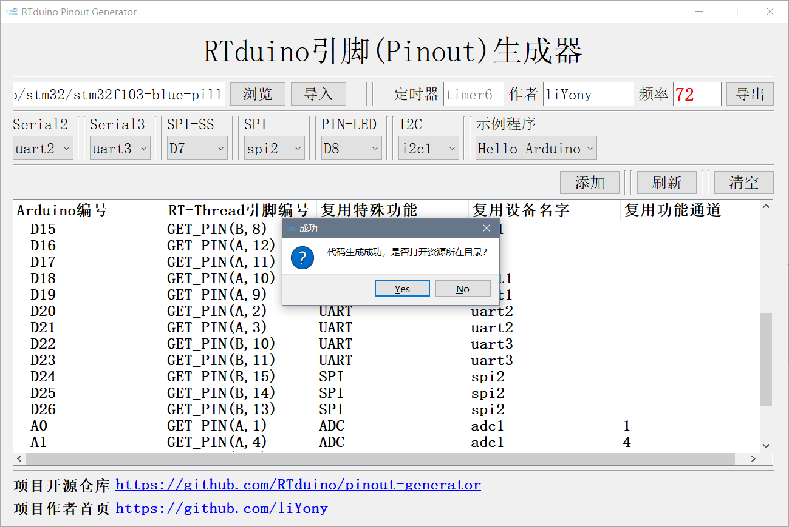

- arduino_main.cpp：里面是一个示例程序。
- pins_arduino.c：这个文件里面保存着我们的映射表。
- pins_arduino.h：这个文件保存着比较重要的宏定义。
- Sconscript：Scons构建脚本。
- Kconfig：Kconfig配置文件。

### 1.5 用户需要修改的地方

#### 1.5.1 pins_arduino.c

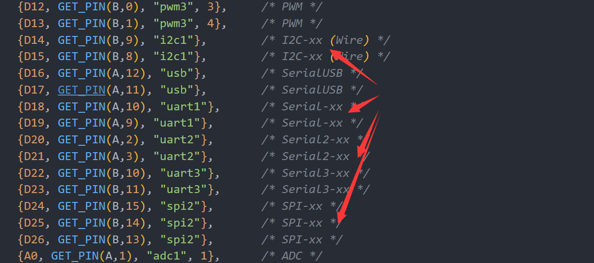

由于软件对注册的设备具体引脚无法区分，所以这块需要人为实现，比如D14是I2C的SDA引脚，需要将I2C-xx修改为I2C-SDA。如下：

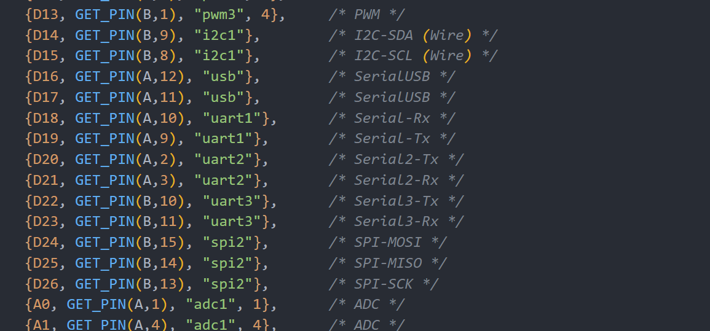

#### 1.5.2 pins_arduino.h

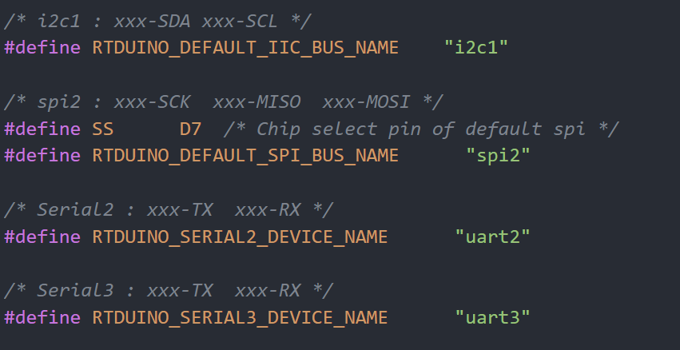

类似，对于这个文件也需要做相应的修改。

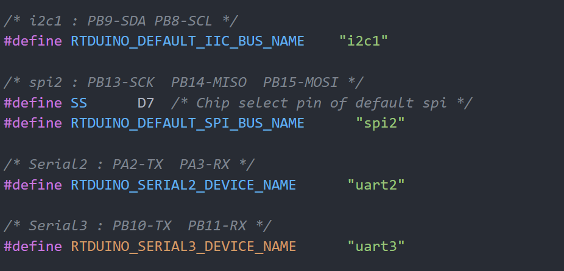

#### 1.5.3 Kconfig

在arduino_pinout文件夹中，会生成一个Kconfig文件夹，这个文件夹我们是不能留的，但是需要把里面的内容拷贝到board文件夹下的Kconfig。

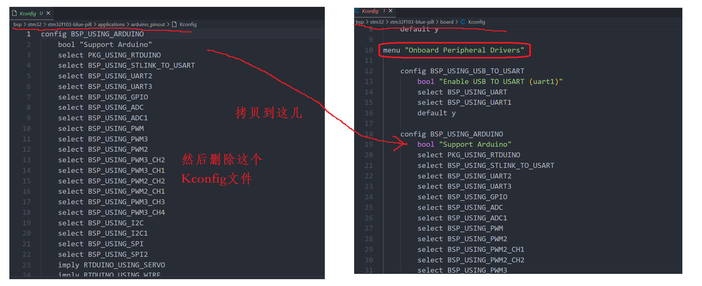

到这，基本就移植完了，最后就是为该bsp编写RTduino的README.md文件（位于applications/arduino_pinout文件夹下）了。README.md可以参考以下BSP编写：

- https://github.com/RT-Thread/rt-thread/tree/master/bsp/stm32/stm32f401-st-nucleo/applications/arduino_pinout
- https://github.com/RT-Thread/rt-thread/tree/master/bsp/stm32/stm32f103-blue-pill/applications/arduino_pinout
- https://github.com/RT-Thread/rt-thread/tree/master/bsp/stm32/stm32l475-atk-pandora/applications/arduino_pinout
