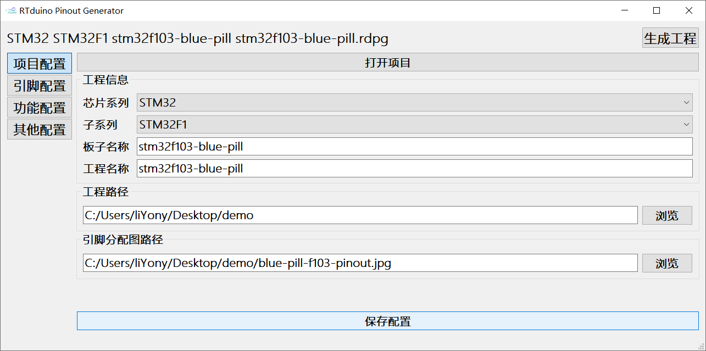
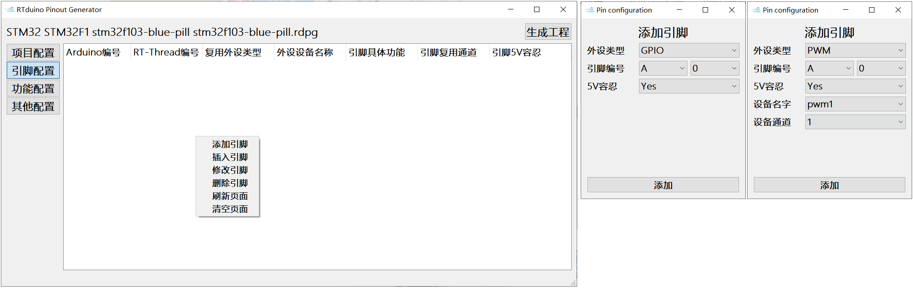
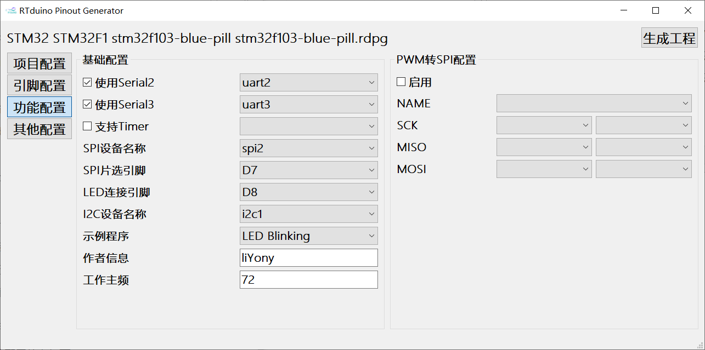
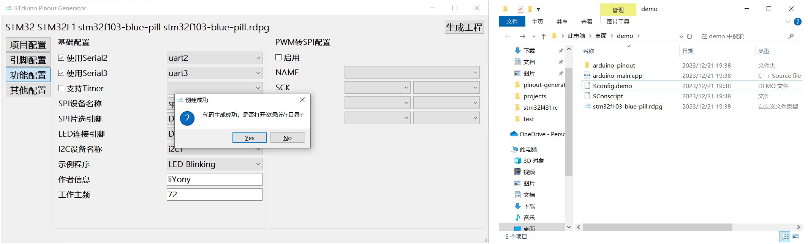
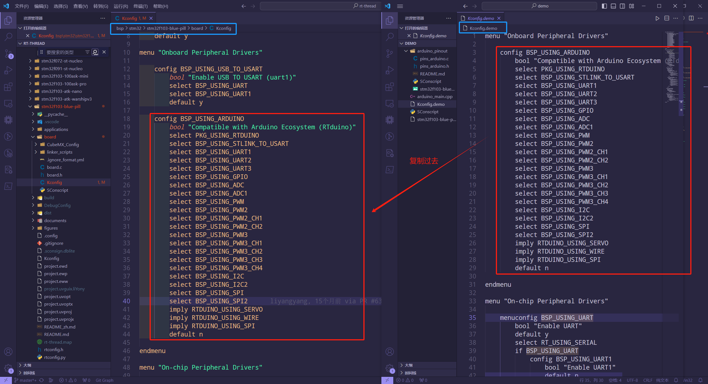
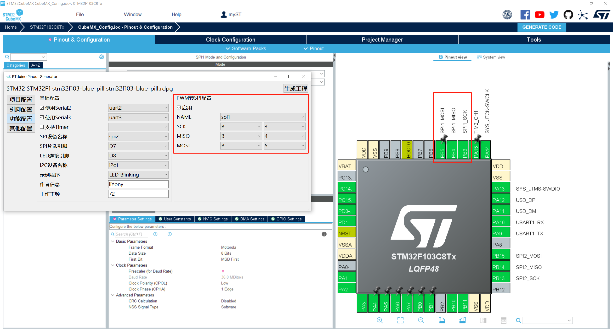
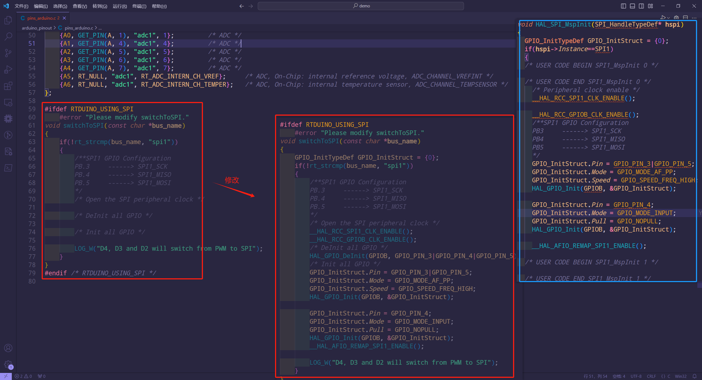

# pinout-generator

pinout-generator是为了方便用户将BSP对接到[RTduino](https://github.com/RTduino/RTduino)上而设计的一个自动化源文件生成工具。下面以 [stm32f103-blue-pill](https://github.com/RT-Thread/rt-thread/tree/master/bsp/stm32/stm32f103-blue-pill/applications/arduino_pinout) 为例，展示如何使用本软件，并将该BSP对接到RTduino上。

## 1 如何使用软件

### 1.1 创建工程项目

打开软件，进入**项目配置**页面。根据本次示例板卡，配置信息如下图。

> 注意
>
> 完成项目配置后，请点击**保存配置**。

### 1.2 进入引脚配置

stm32f103-blue-pill的引脚分配图如下：

根据引脚分配图填写引脚配置。在空白页**右键菜单**唤起菜单项进行引脚添加或其他。

针对本次stm32f103-blue-pill，完成引脚配置如下：

### 1.3 进行功能配置

首先，了解一下各选项的一个含义：

- Serial2：除了RTduino终端串口另外支持的串口。
- Serial3：除了RTduino终端串口另外支持的串口。
- Timer：RTduino需要的默认定时器。
- SPI设备名称：RTduino需要的默认SPI设备。
- SPI-SS：SPI设备的SS(片选)引脚的编号。
- LED引脚：RTduino默认的LED灯引脚。
- I2C设备名称：RTduino需要的默认I2C设备。
- 示例程序：RTduino对接Demo程序。
  - 循环打印<Hello！Arduino>。
  - LED灯以一定频率闪烁。
- 作者信息：对接BSP的作者。
- 工作频率：表示BSP工作的主频，是必填项。
- PWM转SPI配置：部分BSP因为资源受限，可能会将已经对接的PWM设备引脚用作SPI的引脚，但是这里生成的代码仅仅只是一个框架，仍需用户**自行补充**(具体操作见下文)。

根据bsp需求，具体配置信息如下：

### 1.4 生成代码

截至到这，已经完成了基本的对接配置工作，可以生成对应的工程了。

这里对生成的文件进行一个简单的介绍：

- arduino_pinout
  - pins_arduino.c：保存了RT-Thread引脚和RTduino引脚的对应关系。
  - pins_arduino.h：保存了RTduino功能配置相关宏定义。
  - README.md：说明文档。
  - SConscript：RT-Thread工程构建脚本。
  - stm32f103-blue-pill-pinout.jpg：引脚分配图。
- arduino_main.cpp：RTduino示例代码。
- Kconfig.demo：menuconfig相关代码，这里需要**简单移植**(具体操作见下文)。
- SConscript：RT-Thread工程构建脚本。
- stm32f103-blue-pill.rdpg：pinout-generator的工程文件，用户可双击打开。

### 1.5 用户需自行修改

#### Kconfig移植

将`Kconfig.demo`里卖的`Onboard Peripheral Drivers`和`On-chip Peripheral Drivers`的内容拷贝至bsp的board文件夹中的Kconfig文件(bsp/stm32/stm32f103-blue-pill/board/Kconfig)，下图为`Onboard Peripheral Drivers`内容的拷贝示例。

#### PWM转SPI代码移植(非必要，不支持可跳过此章节)

本bsp是不用支持这个选项的，但是这里为了演示该部分如何实现，这里我们配置pwm转spi的spi设备为`spi1`来进行一个本章节的简要介绍。

> 注意：
>
> 这次只是单纯使用CubeMX生成跟SPI引脚初始化有关的代码，生成完代码后，建议重新恢复CubeMX工程。

当选择了pwm转spi后，`pins_arduino.c`文件会生成如下代码，根据注释补充完整即可。补充完整请自行删除`#error`编译报警。

